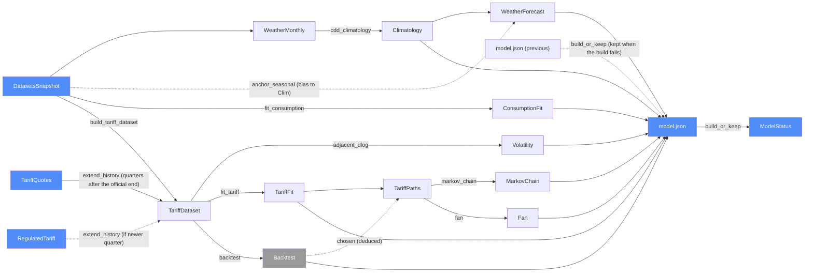

# Analysis — categorical model

> Model-first (FRAMEWORK §2/§4). Intended specification for this component; the
> code realises it (see IMPLEMENTATION.md). Source of record: `analysis/build.py`,
> `analysis/models.py`, `analysis/ols.py`. Decisions M1–M6, S6–S9 in the root `CLAUDE.md`.

## 1. Overview
A pipe-and-filter batch (FRAMEWORK §7.1) that fits every model that does not depend on a
particular household: weather climatology and the bias-anchored seasonal forecast, the
per-dwelling consumption regression, the tariff ARX with its out-of-sample backtest, the
bootstrap simulation of tariff paths, and the K = 5 Markov chain the browser MDP consumes.
Input: `data/snapshots/datasets.json` + `data/snapshots/tariff_quotes.json` (optional) + `site/data/plans.json`. Output: `site/data/model.json`.

## 2. Why
The whole component is one composable chain in `Alg`; modeling it that way makes the
two honesty rules checkable: **model selection is a deduced morphism of the backtest**
(`chosen = argmin rmse_log`, M4), not a stored choice, and **the Markov chain is deduced
from simulated paths** (M5) — nothing downstream may read the ARX coefficients as if they
drove the simulation when the random walk won.

## 3. Core category

## 4. Morphism table
| Morphism | Signature | Partiality | Semantics |
| --- | --- | --- | --- |
| `cdd_climatology` | `WeatherMonthly → (month → ℝ)` | Total | 10-year mean CDD/day per calendar month, base 24 °C (S9) |
| `anchor_seasonal` | `Seasonal × Climatology → WeatherForecast` | Partial | defined only when the seasonal API returned months; keeps shape, level anchored (M2) |
| `fit_consumption` | `kWh series × Weather → ConsumptionFit` | Partial | per dwelling; skipped when < 36 months (M1) |
| `build_tariff_dataset` | `tariff × usep × peak × weather → TariffDataset` | Total | quarterly, ex-GST |
| `extend_history` | `TariffDataset × TariffQuotes × RegulatedTariff → TariffDataset × Gaps` | Total | appends recorded and current quotes ÷ GST for quarters after the official end; `Gaps` = missing quarters up to the last one, never interpolated; rows tagged `official` / `retailer_quote` |
| `quoted_incl_gst` | `TariffDataset × TariffQuotes × RegulatedTariff → (quarter → ℝ)` | Total | the exact quoted GST-inclusive figure of each quote-sourced quarter, so published `incl_gst` is the quote itself, not quote ÷ GST × GST (which drifts by 0.01) |
| `adjacent_dlog` | `TariffDataset → ℝ*` | Total | log changes between consecutive quarters only (hist SD, EWMA vol) |
| `build_or_keep` | `Inputs × model.json(prev) → model.json × ModelStatus` | Total | on any build exception keeps the previous `model.json` and reports `stale` in `site/data/model_status.json` |
| `fit_tariff` | `TariffDataset → TariffFit` | Total | ARX + AR-only + F-test on exogenous block (M3) |
| `backtest` | `TariffDataset → Backtest` | Total | rolling one-step RMSE per candidate mode, 80 % coverage |
| `chosen` | `Backtest → Mode` | Deduced | `argmin rmse_log` — never stored as config (M4) |
| `simulate_tariff` | `TariffFit × Mode × start → TariffPaths` | Total | 4-quarter block bootstrap of historical shocks, drift kept (M4, M6) |
| `markov_chain` | `TariffPaths × start → MarkovChain` | Total | K = 5 levels, row-stochastic transition, initial = start bin (M5) |
| `fan` | `TariffPaths → Fan` | Total | P10/P50/P90 per quarter, incl. GST |
| `ols` | `y × X → coefs, se, t, p` | Total | self-contained OLS with Student-t p-values |

## 5. Functors
`build : DatasetsSnapshot × plans.json × TariffQuotes → model.json` is the composite of §4 — a
pipeline whose last stage multiplies by `GST_FACTOR` so every tariff level in `model.json`
is incl. GST (convention "Rates"). The functor is realised by the pure `build_model`
(`analysis/build.py`); `main` only loads the inputs and writes the result.

## 6. Composition rules
1. `deduction: simulation_model = argmin(backtest.rmse_log)` (M4).
2. `invariant: Σ_j transition[i][j] = 1 for every row; initial is a distribution` (M5).
3. `invariant: simulation with a fixed seed is reproducible`.
4. `constraint: seasonal forecast level = climatology level (mean bias removed)` (M2).
5. `invariant: model.json tariff levels, fan and chain are GST-inclusive; history carries both`.
6. `constraint: a dwelling type with < 36 months of data is omitted, not extrapolated` ("no invented numbers").
7. `invariant: no tariff log change spans a missing quarter` — gaps are reported in `history_gaps`, never bridged.
8. `invariant: a model failure never removes model.json` — `build_or_keep` is total (user requirement: unattended operation).

## 7. Atoms owned (FRAMEWORK §4)
**Trn** — every row in §4, all placed in one Python process.
**Loc** — collapsed to one process (CI runner or developer machine): Dat + Alg (§7.1).
**Trm** — none internal. Inputs arrive as files in the checkout; output is committed by
Ingest's `git_commit_data` step in the same workflow job.

## 8. Bridges to other components (ports)
| Boundary morphism | Signature | Stored? | Semantics |
| --- | --- | --- | --- |
| `datasets_snapshot` | `Ingest → Analysis` | Stored | read-only input |
| `regulated_tariff` | `Ingest → Analysis` | Stored (plans.json) | read-only input |
| `tariff_quotes` | `Ingest → Analysis` | Stored (`data/snapshots/tariff_quotes.json`) | read-only input (optional file); recorded quote per past quarter, fed to `extend_history` |
| `common/tariff.py` (shared module) | `merge_history`, `GST_FACTOR`, `quarter_key`, `shift_quarter` | Code import | neutral module imported by both components; replaces the former `merge_history` import from `scraper.sources.tariff` |
| `model_json` | `Analysis → Site` | Stored (`site/data/model.json`) | weather, consumption, tariff history (`source` per row, `history_gaps`), fan, Markov chain, diagnostics |
| `model_status_json` | `Analysis → Site` | Stored (`site/data/model_status.json`) | `ok` / `stale` + `model_as_of`, `checked_at`, `error`; single writer is `build_or_keep` |

## 9. Coherence notes
Pipe-and-filter law (§7.1) holds: each stage's `t_to` is the next stage's `t_from`.
Law 1 holds as long as Ingest ran first in the same checkout — the workflow orders the
steps; `datasets` is `continue-on-error`, so Analysis always reads the last good snapshot.
A build failure no longer stops the workflow: Analysis is total via `build_or_keep` (it keeps the
previous `model.json` and reports `stale` in `model_status.json`).
Law 4 holds without an advisory: Analysis reads Ingest output only as files and shares code only
through `common/tariff.py`, which imports neither component (a test checks `analysis/` has no `scraper` import).
