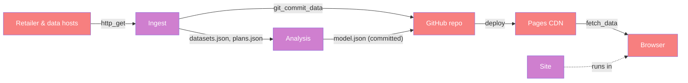

# Whole-system categorical map (Dat/Trn/Loc/Trm)

> Top-level architecture doc (FRAMEWORK §4). Names the four atoms, lists components
> (each linking to its ARCHITECTURE.md), and runs the §4.5 coherence checklist against
> the code. Detail lives in the component docs. Source of record: `.github/workflows/*.yml`,
> `scraper/run.py`, `analysis/build.py`, `site/js/app.js`. Rationale for every decision:
> the decision log in the root `CLAUDE.md`.

## 1. Why
The system is a pipeline split across a physical boundary no server bridges: CI can
scrape but can't see the user; the browser can see the user but can't scrape (CORS, no
secrets). Modeling it with `Loc` and `Trm` makes that split explicit — the **only**
channels between the two halves are three committed JSON files — so any feature that
needs per-user data in CI, or live scraping in the browser, fails Law 1 on paper before
it's written (D5, D6).

## 2. The four atoms (at a glance)
**Dat**
| Datum | Shape | Lives at |
| --- | --- | --- |
| `Plan` | normalised retail plan, GST-incl. ¢/kWh | runner RAM · `data/snapshots/<id>.json` · `site/data/plans.json` · browser |
| `RegulatedTariff` | consensus current-quarter tariff | `plans.json` |
| `RetailerStatus`, `OemListCheck` | freshness / fallback | `site/data/status.json` |
| `DatasetsSnapshot` | SES, data.gov.sg, weather | `data/snapshots/datasets.json` |
| `Model` | climatology, forecasts, fits, fan, Markov chain | `site/data/model.json` |
| `Inputs`, `Bill*` | household answers | browser RAM · localStorage |

**Trn** (owning component)
| Trn | t_from → t_to | Component |
| --- | --- | --- |
| `run_plans` | pages → `plans.json`, `status.json` | Ingest |
| `run_datasets` | sources → `datasets.json` | Ingest |
| `build` | `datasets.json` × `plans.json` → `model.json` | Analysis |
| `compute` | JSON × `Inputs` → ranked rows + recommendation | Site |

**Loc** — `GitHubRunner` (CI job, or a developer machine), `GitHubRepo`, `PagesCDN`,
`Browser` (+ localStorage), external `RetailerHosts` / `DataHosts`.

**Trm**
| Trm | carries | c_from → c_to |
| --- | --- | --- |
| `http_get` | pages, fact sheets, datasets | RetailerHosts/DataHosts → GitHubRunner |
| `git_commit_data` | `site/data/*`, `data/snapshots/*` | GitHubRunner → GitHubRepo |
| `deploy` | `site/` | GitHubRepo → PagesCDN |
| `fetch_data` | three JSON files | PagesCDN → Browser |
| `bills_store` | `Bill*` | Browser ↔ localStorage |

## 3. Components
| Component | Owned `Trn` | Built/active when | Doc |
| --- | --- | --- | --- |
| Ingest | scrape, parse, fallback, enrich_terms, consensus, datasets | daily cron / manual dispatch | [ingest/ARCHITECTURE.md](ingest/ARCHITECTURE.md) |
| Analysis | climatology, consumption fit, tariff ARX, backtest, simulate, Markov chain | after Ingest, same job | [analysis/ARCHITECTURE.md](analysis/ARCHITECTURE.md) |
| Site | billing, household fit, MDP solve/simulate, ranking, render | every page load / input change | [site/ARCHITECTURE.md](site/ARCHITECTURE.md) |

## 4. Placement (only where runsAt is a relation, §4.2)
| `Trn`/`Dat` | placements | why it matters |
| --- | --- | --- |
| adapter `parse` | GitHubRunner (live) · pytest (fixtures) | parsers are tested offline against saved pages |
| `billing`/`household`/`mdp` | Browser · Node (`node --test`, also in the Pages workflow) | a failing model test blocks deploy |
| `Plan` | 4 DataLocs (see §2) | snapshot is the fallback source when a scrape fails |
| `Bill*` | Browser RAM · localStorage | never transmitted off the device (B4) |

## 5. Coherence checklist (§4.5 / §8) against the implementation
- [x] 1. Placement honesty — every browser `Trn` reads fetched JSON or form state; CI `Trn`s read files in the checkout or `http_get` responses.
- [x] 2. Transmission well-typing — all five `Trm`s carry named files/data and cross real boundaries.
- [x] 3. Placement totality — every `Trn` has a site and a component.
- [~] 4. Dependency mediation — Analysis → Ingest is mediated by files, except the direct `merge_history` import (same Loc, so not a failure; suggestion #1).
- [x] 5. Composition soundness — the system is `Ingest ⋈ Analysis ⋈ Site` glued on `datasets.json`, `plans.json`, `status.json`, `model.json`; nothing redescribed.
- [x] 6. runsAt is a relation — multi-placements listed in §4.

## 6. Modeling smells swept (§3)
- No parallel objects: curated, scraped, snapshot, current and SP-tariff plans are one `Plan`.
- Deduced not copied: ranking, headline and charts derive from one `rows`; model selection is `argmin` backtest.
- Duplicated constant: GST encoded twice (suggestion #2). The current tariff exists in two files (suggestion #3).
