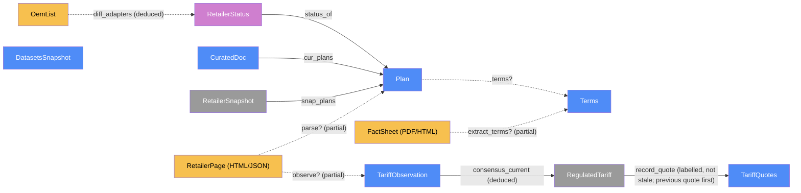
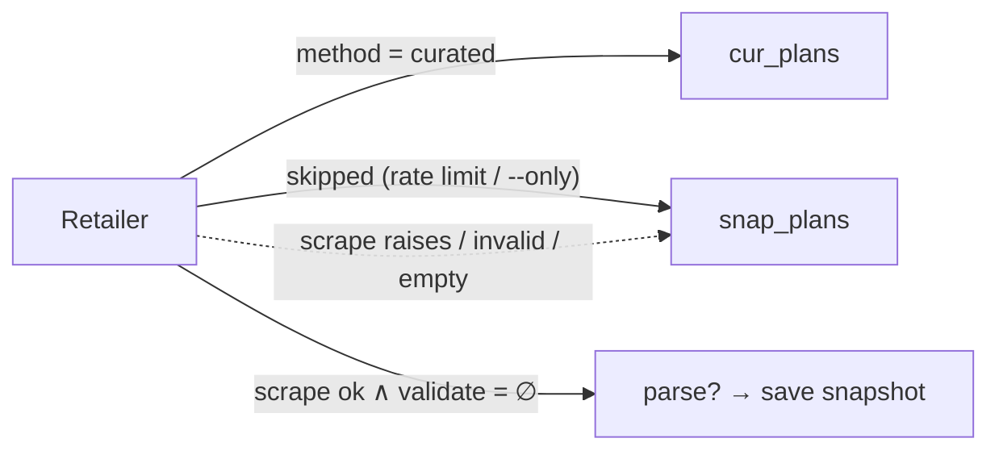

# Ingest — categorical model

> Model-first (FRAMEWORK §2/§4). Intended specification for this component; the
> code realises it (see IMPLEMENTATION.md). Source of record: `scraper/run.py`,
> `scraper/schema.py`, `scraper/http.py`, `scraper/retailers/`, `scraper/sources/`,
> `scraper/terms.py`. Decisions cited as D/S/R/N# refer to the log in the root `CLAUDE.md`.

## 1. Overview
Ingest turns the outside world into normalised JSON. It scrapes seven retailers' plan
pages (one adapter each, two curated), enriches plans with fact-sheet terms, re-checks
the OEM retailer list, derives the current regulated tariff by consensus, and refreshes
the statistical datasets (EMA SES, data.gov.sg, Open-Meteo). It runs only in CI (or
locally by hand) and writes `data/snapshots/*.json` and `site/data/{plans,status}.json`.

## 2. Why
Two things here are easy to get wrong in prose and easy to check as a model:
(a) **`Plan` is one object** — scraped, curated and snapshot-served plans are the same
`Dat` with a `data_method` discriminator and a partial `stale?` flag, not three parallel
types (§3); (b) **the fallback chain is a sum**: every retailer's output is
`fresh ⊕ snapshot ⊕ curated`, so a retailer is never silently dropped. Writing
`scrape : RetailerPage → Plan*` as a *partial* morphism, with `fallback` total, makes that
guarantee a composition rule rather than a hope.

## 3. Core category

## 4. Morphism table
| Morphism | Signature | Partiality | Semantics |
| --- | --- | --- | --- |
| `parse?` | `RetailerPage → Plan*` | Partial | adapter `parse()`; pure; undefined (raises / fails validation) when the layout changed (N2, N5) |
| `observe?` | `RetailerPage → TariffObservation` | Partial | the current-quarter tariff quoted on a retailer page (PacificLight, Senoko) (S7). `tariff_quarter` comes from PacificLight's "Regulated Tariff in Qn YYYY" and from Senoko's "Qn YYYY SP Tariff of Y¢" (the latter only when Y equals the page's prevailing figure) |
| `snap_plans` | `RetailerSnapshot → Plan*` | Total | last-known-good plans, carrying their original `fetched_at` |
| `cur_plans` | `CuratedDoc → Plan*` | Total | hand-verified plans (Keppel, Sembcorp) with `verified_at` (S3, S4) |
| `extract_terms?` | `FactSheet → Terms` | Partial | ETF (flat / schedule / by dwelling), auto-renewal, standard flag; undefined when no field found (D3, N8) |
| `terms?` | `Plan → Terms` | Partial | attached once per fact-sheet URL via the cache (R4) |
| `consensus_current` | `TariffObservation* → RegulatedTariff` | Deduced | observations from an earlier calendar quarter than the newest `as_of` are dropped; mode of the rest, ties → most recent `as_of`; `quarter` only from an agreeing source with label ∈ [q(as_of), q(as_of)+1], else `None`; `observed_at` = newest `as_of` of agreeing sources; `stale` after 48 h |
| `record_quote` | `TariffQuotes × RegulatedTariff → TariffQuotes` | Total | identity unless labelled and not stale; a different value for a recorded quarter overwrites and keeps `revised_from`. Applied to the previous run's quote, then the new one |
| `status_of` | `RetailerStatus → Plan*` | Total | per-retailer outcome: `ok · no_residential_plans · curated · failed · blocked_by_robots` + `stale?` |
| `diff_adapters` | `OemList → {new, missing}` | Deduced | OEM hosts vs adapter homepages; "could not be checked" when nothing parsed (S5) |
| `with_gst` | `ℝ(ex) → ℝ(incl)` | Total | the only GST conversion point for scraped rates (convention "Rates") |
| `validate_plan` | `Plan → 𝕊*` | Total | empty ⟺ plan acceptable (N5) |

`Plan` shape (one object, §3): `{id, retailer_id, name, price_type ∈ {fixed, dot_pct, dot_cents, tou, block}, rates, contract_months, daily_charge_cents, rebate_sgd, rebate_sgd_non_sp?, green, standard?, eligibility?, smart_meter_required, factsheet_url?, terms?, data_as_of, data_method, conditions}`.

## 5. Functors
**Fallback functor** `resolve : Retailer → Plan*` (per retailer per run):

| Branch | Condition | Status written |
| --- | --- | --- |
| curated | `a.method == "curated"` | `curated` |
| skip | `--only` excludes, or < 20 h since last success (R3) | previous status + `skipped` |
| fresh | scrape ok, no validation errors, plans non-empty or `no_residential_plans` | `ok` / `no_residential_plans` |
| fallback | any exception | `failed` / `blocked_by_robots`, `stale = bool(plans)` |

**Politeness natural transformation** `polite : Id ⇒ Id` over every HTTP fetch: robots.txt
check, ≥ 5 s per-host spacing, ≤ 20 requests/host/run, retry on 429/5xx (R1, R2). It does
not change what any fetch returns — naturality is the "never bypass bot protection" law.

## 6. Composition rules
1. `invariant: every adapter in ADAPTERS yields a status entry every run` — no retailer is silently dropped.
2. `invariant: validate_plan(p) ≠ ∅ for any p ⟹ the whole scrape is a failure → fallback` (N5).
3. `constraint: rates in Plan are GST-inclusive ¢/kWh; conversion happens only in parse via with_gst` .
4. `deduction: RegulatedTariff = consensus_current(observations)`; when none, previous value with `stale = true`.
5. `invariant: OemList unparseable ⟹ checked = false` — never reported as "no changes".
6. `constraint: each fact-sheet URL is fetched at most once (errors retried after 7 d), ≤ 25 per run` (R4).
7. `invariant: tiered plans never ranked on a headline rate` — unparseable price text ⟹ plan rejected (N2).
8. `constraint: datasets refreshed at most every 7 days; a failed source keeps its previous value` (R3).
9. `invariant: every labelled, non-stale RegulatedTariff ever published is in TariffQuotes` — the past quarter's quote survives the quarter change (fix-tariff-quarter-gap).

## 7. Atoms owned (FRAMEWORK §4)
**Trn**
| `Trn` | `t_from → t_to` | Realising code |
| --- | --- | --- |
| `scrape ⊸` | `Adapter → ScrapeResult` | `scraper/retailers/base.py:Adapter` |
| `parse` | `RetailerPage → Plan*` | each `scraper/retailers/*.py` adapter |
| `run_plans ⊸` | `Adapters × Snapshots → plans.json × status.json` | `scraper/run.py:run_plans` |
| `update_quotes ⊸` | `TariffQuotes × prev quote × consensus → TariffQuotes` | `scraper/sources/tariff.py:update_quotes` (called from `run_plans`) |
| `enrich_terms ⊸` | `Plan* × TermsCache → Plan*` | `scraper/run.py:enrich_terms` |
| `check_retailer_list ⊸` | `OemPage → OemListCheck` | `scraper/run.py:check_retailer_list` |
| `run_datasets ⊸` | `Sources → DatasetsSnapshot` | `scraper/run.py:run_datasets` |

**Loc** — collapsed to one process: the GitHub Actions runner (`ubuntu-latest`) or a
developer machine. Pure `parse` is also placed in the pytest process against fixtures.

**Trm**
| `Trm` | carries | c_from → c_to |
| --- | --- | --- |
| `http_get` | `RetailerPage` / `FactSheet` / `OemPage` / dataset payloads | retailer & data hosts → runner |
| `git_commit_data` | `plans.json`, `status.json`, `data/snapshots/*` | runner → GitHub repo (refresh-data workflow) |

**Placements (§4.2)** — `parse` has two `TrnLoc`s: CI runner (live) and pytest (fixtures).
`Plan` has three `DataLoc`s: runner RAM, `data/snapshots/<id>.json`, `site/data/plans.json`.

## 8. Bridges to other components (ports)
| Boundary morphism | Signature | Stored? | Semantics |
| --- | --- | --- | --- |
| `plans_json` | `Ingest → Site` | Stored (`site/data/plans.json`) | plans + regulated tariff, read by the browser |
| `status_json` | `Ingest → Site` | Stored (`site/data/status.json`) | freshness / fallback badges |
| `datasets_snapshot` | `Ingest → Analysis` | Stored (`data/snapshots/datasets.json`) | SES, data.gov.sg, weather |
| `regulated_tariff` | `Ingest → Analysis` | Stored (in `plans.json`) | extends the tariff history by the current quarter |
| `tariff_quotes` | `Ingest → Analysis` | Stored (`data/snapshots/tariff_quotes.json`) | `TariffQuotes`: recorded quote per past quarter; extends the lagging official history |
| `common/tariff.py` (shared module) | `merge_history`, GST constants, quarter helpers | Code import | imported by Ingest and Analysis; imports neither (replaces the former `merge_history` reach from Analysis into Ingest code) |

## 9. Coherence notes
- **Law 1** holds: every `parse` input is delivered by `http_get` or a fixture file.
- **Law 2** holds: the only cross-Loc flows are `http_get` and `git_commit_data`, both typed.
- **Law 4**: Ingest → Analysis dependency is mediated by files in the same checkout
  (same Loc at contact point in CI); locally the same. Shared code is a neutral module,
  `common/tariff.py`, that imports neither component, so no code-level reach remains.
- `TariffQuotes` is written only by `run_plans`; Analysis reads it as a file (`tariff_quotes` port).
