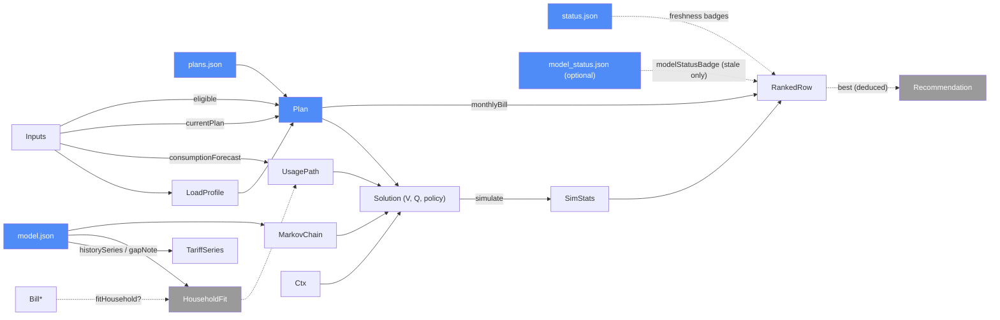

# Site — categorical model

> Model-first (FRAMEWORK §2/§4). Intended specification for this component; the
> code realises it (see IMPLEMENTATION.md). Source of record: `site/index.html`,
> `site/js/app.js`, `site/js/ui.js`, `site/js/billing.js`, `site/js/household.js`, `site/js/mdp.js`.
> Decisions P1–P9, B1–B4, N3–N8 in the root `CLAUDE.md`.

## 1. Overview
The static GitHub Pages app. It fetches the published JSON files (three required, plus an optional `model_status.json`), reads the
household's inputs (and optional past bills), and computes everything per-user in the
browser: the usage forecast, each plan's monthly bill, the contract-switching MDP by
backward induction, a Monte-Carlo simulation of each first action, and the ranking. No
server; nothing the user enters leaves the browser (B4).

## 2. Why
The browser holds **one** plan vocabulary: the user's current plan, the SP regulated
tariff and every scraped plan are all `Plan` (§3) — `currentPlan` and `SP_TARIFF_PLAN`
are constructors of the same object, which is why `solve` can treat "keep" and "switch"
uniformly as actions over `plans[q]`. And the recommendation is a **deduced** morphism of
the MDP solution, not stored state, so the headline, table and charts cannot disagree.

## 3. Core category

## 4. Morphism table
| Morphism | Signature | Partiality | Semantics |
| --- | --- | --- | --- |
| `eligible` | `Plan × Inputs → 𝔹` | Total | green/standard filters; standard-unknown excluded (N6); SP-only plans need current = SP |
| `currentPlan` | `Inputs → Plan` | Total | user's own plan (fixed / dot) or the SP tariff; `months_left`, renew term, user ETF (P7) |
| `fitHousehold?` | `Bill* × Weather × b₀ → HouseholdFit` | Partial | undefined with no valid bills; Gaussian shrinkage of `b` to national (B2) |
| `consumptionForecast` | `Inputs × HouseholdFit? × Weather → UsagePath` | Total | monthly kWh over the horizon; household a,b when fitted, else national (B3) |
| `withNightShare` | `LoadProfile × ℝ → LoadProfile` | Total | rescales the 24-h shape to the night-share slider |
| `energyCents` / `monthlyBill` | `Plan × kWh × days × tariff × profile → ℝ` | Total | per `price_type`: fixed, dot_pct, dot_cents, tou (windows wrap midnight), block (marginal); plus daily charge (N1, N3) |
| `effectiveRate` | `Plan × … → ℝ` | Deduced | `monthlyBill / kWh` |
| `scalePlan` | `Plan × ℝ → Plan` | Total | future re-contract offers scale with the tariff (P3); dot plans unchanged |
| `etfFor` | `Plan × monthsLeft × Ctx → ℝ` | Total | flat / by-month schedule / by-dwelling / user-assumed default (N8) |
| `switchCost` | `Plan × r × Plan × Ctx → ℝ` | Total | ETF + hassle + smart-meter fee for TOU without meter (P4) |
| `solve` | `Plan* × Chain × UsagePath × Ctx → Solution` | Total | monthly backward induction; tariff moves at quarter starts only (P1, P2) |
| `simulate` | `Solution × q → SimStats` | Total | seeded paths; mean, P10, P90, share with a later switch |
| `score` | `SimStats × λ → ℝ` | Deduced | `mean + λ·(P90 − mean)` (P6) |
| `best` | `RankedRow* → Recommendation` | Deduced | argmin score; "wait until end of MMM YYYY" when keep wins (P8) |
| `frozen_check` | `→ 𝔹` | Deduced | re-solve with `frozenOffers`; warns if the winner changes (P3) |
| `esc` / `safeUrl` | `𝕊 → 𝕊` / `𝕊 → 𝕊?` | Total / Partial | every scraped string escaped; only `https://` links rendered |
| `historySeries` | `History × Gaps → Row*` | Total | official rows (missing `source` = official) and `retailer_quote` rows; each gap inside the observed range becomes a null row; missing or empty gaps are fine |
| `gapNote` | `Gaps → 𝕊` | Total | warning line with escaped quarter labels; empty string when there are no gaps |
| `modelStatusBadge` | `ModelStatus? → 𝕊` | Partial | defined only for `state = stale` (escaped `error` in `title`); empty for `ok`, a missing file or anything unrecognised |

## 5. Functors
**MDP state space** `S = Plan × monthsLeft × levelAtSigning × currentLevel`, actions
`keep ⊕ switch(q')`. `solve` is the Bellman functor from horizon `T` back to `t = 0`;
`policyAt` reads the argmin action back out.

## 6. Composition rules
1. `invariant: E[simulate(sol, q)] ≈ sol.firstQ[q]` (undiscounted check) — simulation and Bellman agree.
2. `constraint: tariff level changes only when the month is a calendar quarter start` (P2).
3. `invariant: current contract with r months left ends after exactly r monthly steps` (P2, P7).
4. `constraint: rebates are one-off and counted only on today's offers when ticked` (N4).
5. `invariant: moving out before the stay ends pays the ETF for contract time remaining` (P5).
6. `deduction: recommendation = best(rows)`; table, headline and charts read the same `rows`.
7. `constraint: no scraped string reaches innerHTML unescaped; no non-https URL is linked`.
8. `constraint: bills never leave the browser (localStorage only, try/catch)` (B4).
9. `constraint: quarters in history_gaps are rendered as breaks, never interpolated`; `retailer_quote` points are marked as not-yet-official.

## 7. Atoms owned (FRAMEWORK §4)
**Trn** — every row of §4, placed in the browser main thread; `billing`, `household`,
`mdp` and the pure helpers in `ui.js` are also placed in the Node test runner (`node --test`)
and in the Pages workflow before deploy.

**Loc** — `Browser` (main thread + localStorage), `Pages CDN` (static files), Node (tests).

**Trm**
| `Trm` | carries | c_from → c_to |
| --- | --- | --- |
| `fetch_data` | `plans.json`, `status.json`, `model.json`, optional `model_status.json` | Pages CDN → Browser |
| `load_app` | `index.html`, `js/*`, `css/*` | Pages CDN → Browser |
| `bills_store` | `Bill*` | Browser RAM ↔ localStorage (`electricity-picker.bills.v1`) |
| `deploy` | `site/` | GitHub repo → Pages CDN (pages workflow, only after a successful refresh) |

**Placements (§4.2)** — `billing`/`household`/`mdp` have two `TrnLoc`s (Browser, Node);
`Bill*` has two `DataLoc`s (RAM, localStorage).

## 8. Bridges to other components (ports)
| Boundary morphism | Signature | Stored? | Semantics |
| --- | --- | --- | --- |
| `plans_json` | `Ingest → Site` | Stored | `Plan*` + `regulated_tariff` |
| `status_json` | `Ingest → Site` | Stored | freshness, fallback, OEM list check |
| `model_json` | `Analysis → Site` | Stored | chain, fan, consumption coefs, weather; `tariff.history[].source` (`official` \| `retailer_quote`, missing = official) and `tariff.history_gaps` (quarters nobody observed, may be absent or empty) |
| `model_status_json` | `Analysis → Site` | Stored, optional | `site/data/model_status.json`: `{state: ok\|stale, model_as_of, checked_at, error?}`; a missing file means no information and shows nothing |

## 9. Coherence notes
- **Law 1**: every `Trn` reads either the fetched JSON or form state present in the
  browser. Opened from `file://`, `fetch_data` fails and `main()` shows an error rather
  than computing on nothing.
- **Law 6**: `billing`/`mdp` run in two places by design (browser + Node tests) — same code.
- Current tariff is read from `model.json.tariff.current_incl_gst` (Analysis), while
  `plans.json.regulated_tariff` feeds the freshness banner; the two copies are checked to agree by
  `tests/test_common.py` (shared-tariff-module, closes suggestion #3).
